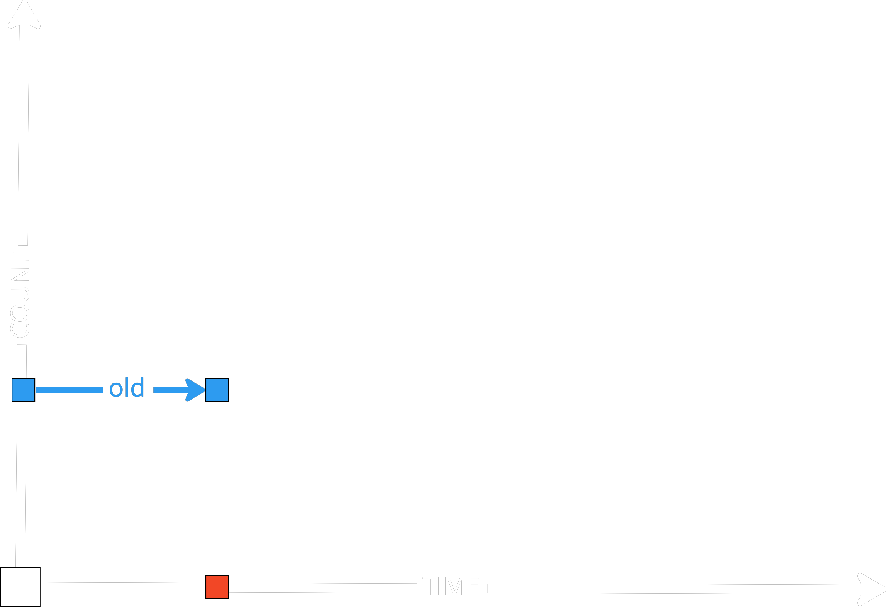
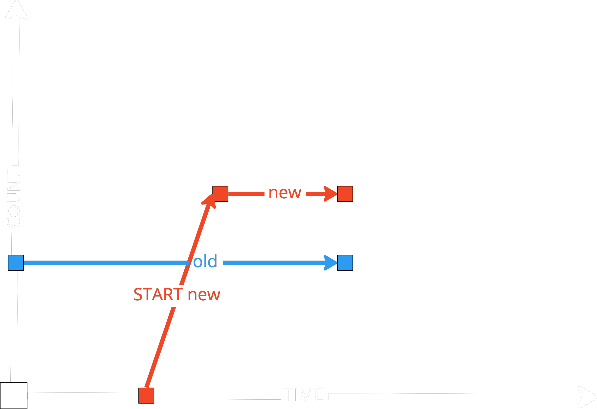
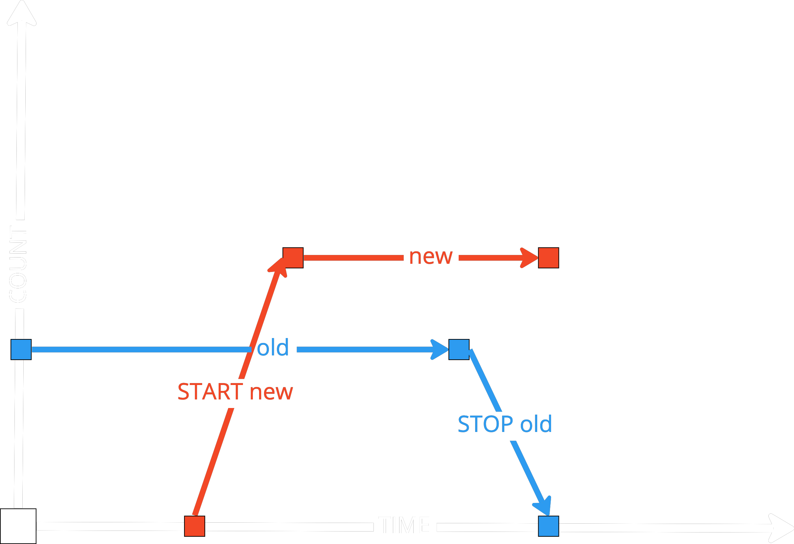
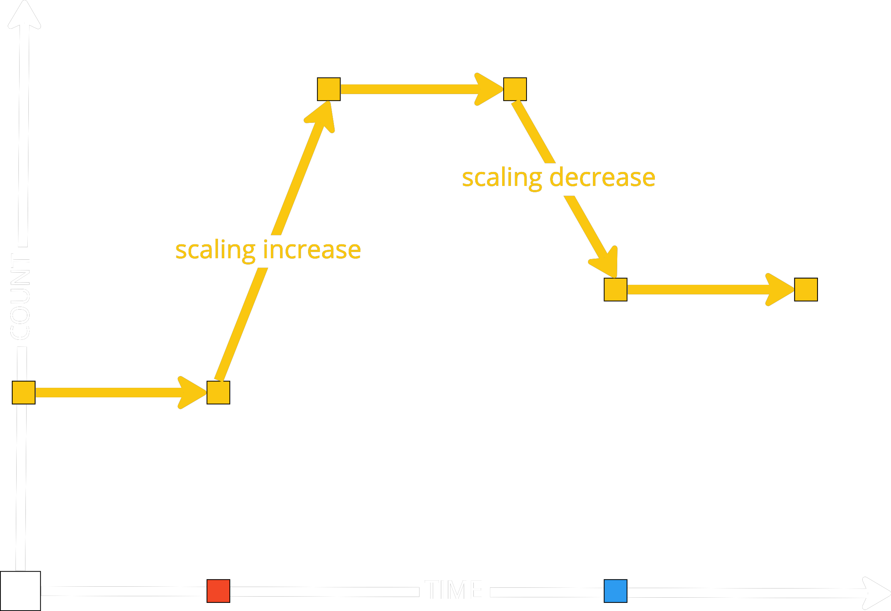
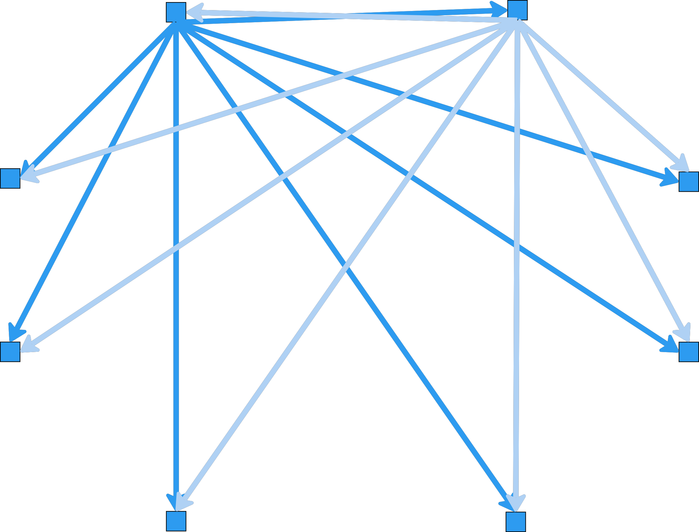
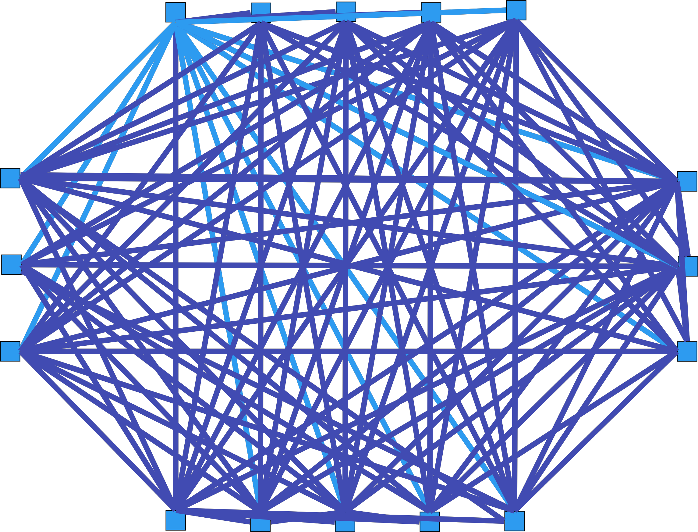
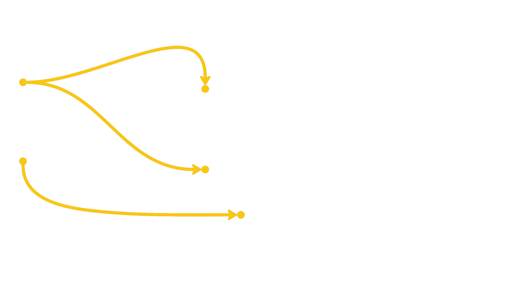

<!-- _class: lead
-->

# Что нового в нагрузке

## для меня в __2022__ году?

### Смирнов Вячеслав, Miro

<!--
_footer: `Image by Vlad Gerasimov on https://vlad.studio/`
 -->

---
<!-- _class: title -->

# Ускоряю  Miro
## Развиваю  @qa_load
### Изучаю языки и технологии


---

<!-- _class: main2 -->


## 2007, 2018, 2022 : хакер,тимлид,инженер


<!--
_footer: `https://dvdbash.com/2013/01/20/the-x-files-gallery-season-1/`
-->

---

<!-- _class: main2 -->

# 1️⃣ Что нового в нагрузке сделал я?

## 2️⃣ Что нового в нагрузке сделали другие?

<!--
_footer: `Image by Vlad Gerasimov on https://vlad.studio/`
 -->


---

<!-- _class: main -->

# 1️⃣ Что нового в нагрузке __сделал я__?

<!--
_footer: `Image by Vlad Gerasimov on https://vlad.studio/`
 -->

---


<div align="center"><video autoplay loop html muted class="bg" onclick="this.paused ? this.play() : this.pause(); this.blur()" onpause="" width="80%"><source src="img/plan.mp4" type="video/mp4"></video></div>


---

<!-- _class: main -->

# Цель — создать __сообщество performance-инженеров__ внутри компании

---

<!-- _class: main2 -->

# Собираем вещи, есть работа


<!--
_footer: `https://dvdbash.com/2013/01/20/the-x-files-movie-i-want-to-believe-2008/`

-->

<!--

AWS, своих датацентров никто не строит, специфика Украины - все хостится в облаках, в России - все хостятся у себя.

Облачные реалии наступают.

В связи с переездом многие вещи. Изменились.

Вот я никогда не работает с AWS и тестирование нагрузки в облаках это другое. Вы не понимаете - это другое.

-->


---

# Другой язык, __AWS__ и облака, тестирование в облаках


---

<!-- _class: main2 -->

# Тестирование __обновлении__, __масштабирования__ и __автомасштабирования__

## Hazelcast, JUnit, Jenkins, Prometheus, Grafana

---

# __Старая версия__ системы работает



---

# __Новая версия__ системы запускается (с запасом)



---

# __Старая версия__ системы останавливается



---

# __Быстрый рост на 120-150%__ и быстрый спад



---

# Что нужно протестировать?

## __Быстрый рост кластера__ распределенных кешей

## __Быстрый спад кластера__ распределенных кешей

## __Быстрый рост пула__ подключений к базе данных

## ...

## __Как быстро__ можно запускать и останавливать?

## __На каком размере кластера__ можно обновляться?

---

# __Малый кластер успевает__ синхронизироваться



---

# __Большой кластер не успевает__ синхронизироваться



---

# __Большой кластер не успевает__ синхронизироваться

- Размер пакета с состоянием кластера растет __x 2.2-2.5__

- Количество обновлений состояний кластера растет __x 2.2-2.5__

- Если 1 запрос работает __1 мсек__, то __1000 узлов — предел__ для кластера

- И значит на кластере в __400 узлов__ обновляться еще __можно__

- А на кластере в __500 узлов__ обновляться уже __нельзя__

- Был выбран размер в __200 узлов__


<!--

Иллюстрация

Тестирование обновления кластера. 1000 - 2000 нод.

Squisse, тестирование одной ноды на проде до ее пределов.
Потом две ноды.
Проверка линейности масшабирования системы.

-->


---

<!-- _class: main -->

# Давать __метрики командам__, но не судить о производительности

<!--

Команды пугают другие вещи - мы делали-делали, подали нагрузку, а тут вот ... медленно стало. 

Команды хотят Feature toggle. 

Тестированеи производительности
1) Проверка по факту
2) Метрики на проде, трейсинг, который покажет, в чем узкое место

Arrange, Act, (Assert)

-->

---

<!-- _class: main -->

# Переход к __простым__ тестам

Написание тестов на узкое место.  Написание маленького теста на проблему.

---

# __Переход к простым тестам__, вместо сложных на 100 ручек

```javascript
export function setup() {
    return do_auth(CONF.url, CONF.login, CONF.token);
}
export default function (auth) {
    if (__ITER == 0) do_apply_cookie(auth, CONF.url);
    http.get(`${CONF.url}/api/v1/accounts/${CONF.accountId}`,{
        tags: { name: '(GET) /api/v1/accounts/ID' }});
}
export function teardown(auth) {
    do_apply_cookie(auth, CONF.url); do_logout(CONF.url);
}
export function handleSummary(data) {
    return do_handleSummary(data);
}
```


---

# __auth__ — результат аутентификации, __data__ — статистика

```javascript
export function setup() {
```
```js
    return do_auth(CONF.url, CONF.login, CONF.token);
}
```
```javascript
export default function (auth) {
```
```js
    if (__ITER == 0) do_apply_cookie(auth, CONF.url);
    http.get(`${CONF.url}/api/v1/accounts/${CONF.accountId}`,{
        tags: { name: '(GET) /api/v1/accounts/ID' }});
}
```
```javascript
export function teardown(auth) {
```
```js
    do_apply_cookie(auth, CONF.url); do_logout(CONF.url);
}
```
```javascript
export function handleSummary(data) {
```
```js
    return do_handleSummary(data);
}
```


---

# __Меняется одна функция__ и конфиг при тиражировании

```js
export function setup() {
    return do_auth(CONF.url, CONF.login, CONF.token);
}
```
```javascript
export default function (auth) {
    if (__ITER == 0) do_apply_cookie(auth, CONF.url);
    http.get(`${CONF.url}/api/v1/accounts/${CONF.accountId}`,{
        tags: { name: '(GET) /api/v1/accounts/ID' }});
}
```
```js
export function teardown(auth) {
    do_apply_cookie(auth, CONF.url); do_logout(CONF.url);
}
export function handleSummary(data) {
    return do_handleSummary(data);
}
```

---

<!-- _class: main -->

# Запуск тестов из __Docker__ с разными профилями

<!--
Почему раньше не запускали тесты из Docker? Были проблемы производительности самого Docker. Сейчас он позволяет.

Istio, Envoy, balancer, ...

Особенно, когда тестируются сервисы развернутые в k8s

Разработчик может запустить нагрузку локального с локальной машины разработчика

-->

---

# __Параметризация__ тестовых данных, стенда и профиля
```yaml
  k6_test_accounts:
    image: grafana/k6:0.40.0
    restart: "no"
    volumes:
      - "./src/test/config/:/tmp/src/test/config/:ro"
      - "./src/test/k6/:/tmp/src/test/k6/:ro"
      - "./results/k6_test_account:/tmp/results/:rw"
    environment:
      - TEST_CONFIG=perf-environment-1.big-workload.json  # Стенд и тестовые данные   
      - K6_RPS=20                                         # Интенсивность (профиль)
      - K6_VUS=20                                         # Время отклика (SLA)
      - K6_ITERATIONS=10000                               # Длительность теста
    working_dir: "/tmp/results/"
    command: "run --insecure-skip-tls-verify
    --out influxdb=http://influxdb:8086/k6 
    /tmp/src/test/k6/test_accounts.js
    "
```

---

<!-- _class: main -->

# Автоматизация нагрузка по расписанию или кнопке через __Jenkins__, __Github Actions__

<!--
Много денег надо будет за облако. И для нагрузки становится важно развертывать и свертывать конрут нагрузки.
-->

---

# Работа со стендом и метриками наиболее сложны

- Восстановление системы из снимка
- Обновление версии системы
- Запуск и подготовка системы к тестированию
- Запуск тестов производительности
    - Запомнить время старта
    - Запустить профилирование до старта
    - __Тест__, скрипт подачи нагрузки
    - Сохранить результаты теста
    - Сохранить системные метрики за тест
    - Сохранить логи, результаты профилирования и ссылки
    - Сравнить метрики и отправить нотификации о деградации
- Остановка системы
- Остановка окружения

---

<!-- _class: main -->

# Применение  __Jaeger__ и __OpenTracing__ для составления и анализа профиля нагрузки

<!--
Добавить картинку.
-->
---

<!-- _class: main -->

# Тесты __API__ продуктива на малой интенсивности

<!--
Прод стабилен.
Нагрузить его в 1 rps -- можно.
Для читающих операций.
Или даже для пишуших, если его изолировать.

Нагрузить в 100 rps не очень.
-->

---

<!-- _class: main -->

# Тесты продуктива с __sitespeed__**.io**

<!--
lithhouse -- для ручной проверки.
А тут как LH с мониторингом
-->

---

<!-- _class: main -->

# 2️⃣ Что нового в нагрузке сделали другие?

<!--
_footer: `Image by Vlad Gerasimov on https://vlad.studio/`
 -->

---

<div align="center"><video autoplay loop html muted class="bg" onclick="this.paused ? this.play() : this.pause(); this.blur()" onpause="" width="80%"><source src="img/plan2.mp4" type="video/mp4"></video></div>

---

- Андрей Похилько - новый инструмент для нагрузки и Mizu.io - отличная утилита для разбора проблем в Kubernetes
- Илья Бровкин - новая платформа для Web3 https://www.linkedin.com/in/iliyabrovkin/
- Олесь Писаренко - новый инструмент для нагрузки на GoLang https://www.linkedin.com/in/doctornkz/
- Андрей Сатарин - https://www.linkedin.com/in/asatarin/ тестирование корректности распределенных систем во время обновления и отката версиий в дополнение к стресс-тестированию в помощью unit-тестов, выполняемых во время обновления или масштабирования системы https://asatarin.github.io/talks/2022-09-upgrade-failures-in-distributed-systems/
- Андрей Акиньшин - новая книга Профессиональный бенчмаркинг
- Антон Серпутько - работает в США, участвовал в подкасте по производительности https://t.me/dou_qa/484
- Mark Tomlinson - сделал курс по эксплуатационному тестированию производительности, тестирование цель которого в поиске узких мест и записал много новых выпусков подкаста PerfBytes https://www.linkedin.com/in/mtomlins/ 
- Paul McLean - предоставляет API для тестовых данных, https://www.youtube.com/watch?v=bFAICy5j35M https://www.linkedin.com/in/paulmclean2/ интересные материалы, тестирование производительности Starlink и геораспределенное тестирование с помощью Gatling, тренды тестирования приоизводительности в 2021 году https://www.youtube.com/watch?v=z3yvh4syuqw и https://www.mammoth-ai.com/top-performance-engineering-trends-5-things-your-team-needs-to-know/
- Joe Calantonio, Performance & SRE Podcast https://testguild.com/podcasts/performance/ и https://www.linkedin.com/in/joecolantonio/
- Andreas Grabner https://www.linkedin.com/in/grabnerandi/ OpenTelemetry, Keptn
- Federico Toledo, jmeter-java-dsl https://www.linkedin.com/in/federicotoledo/
- Vitaly Friedman, https://www.linkedin.com/in/vitalyfriedman/, 
- Alex Xu, https://www.linkedin.com/in/alexxubyte/ System Design
- 🤠Leandro Melendez (Señor Performo) https://www.linkedin.com/in/leandromelendez/ интервью с разными инженерами
- Henrik Rexed https://www.linkedin.com/in/hrexed/ Observability, Dynatrace, OpenTelemetry, eBPF
- Jason Arbon, test.ai, https://www.linkedin.com/in/jasonarbon/ 
Batch вставка результатов тестов, после выполнения всех тестов это быстрее, чем вставка результатов тестов после каждого теста
- Mehdi Daoudi, Cachpoint https://www.linkedin.com/in/mdaoudi/ 
- Kent Beck, 
- Stephen Townshend, https://www.linkedin.com/in/stephentownshend/
- Jeff Barr, 
- Delvis Echeverria, https://www.linkedin.com/in/delvisecheverria/recent-activity/
- Denis Bakhvalov, https://www.linkedin.com/in/dendibakh/
- 

---

