<!-- _class: lead
-->

# Что нового в нагрузке

## для меня в __2022__ году?

### Смирнов Вячеслав, Miro

<!--
_footer: `Image by Vlad Gerasimov on https://vlad.studio/`
 -->

---
<!-- _class: title -->

# Ускоряю  Miro
## Развиваю  @qa_load
### Изучаю языки и технологии


---

<!-- _class: main2 -->


## 2007, 2018, 2022 : хакер,тимлид,инженер


<!--
_footer: `https://dvdbash.com/2013/01/20/the-x-files-gallery-season-1/`
-->

---

<!-- _class: main2 -->

# 1️⃣ Что нового в нагрузке сделал я?

## 2️⃣ Что нового в нагрузке сделали другие?

<!--
_footer: `Image by Vlad Gerasimov on https://vlad.studio/`
 -->


---

<!-- _class: main -->

# 1️⃣ Что нового в нагрузке __сделал я__?

<!--
_footer: `Image by Vlad Gerasimov on https://vlad.studio/`
 -->

---


<div align="center"><video autoplay loop html muted class="bg" onclick="this.paused ? this.play() : this.pause(); this.blur()" onpause="" width="80%"><source src="img/plan.mp4" type="video/mp4"></video></div>


---

<!-- _class: main -->

# 📝 Цель — создать __сообщество performance-инженеров__ в компании

---

<!-- _class: main2 -->

# Собираем вещи, есть работа


<!--
_footer: `https://dvdbash.com/2013/01/20/the-x-files-movie-i-want-to-believe-2008/`

-->

<!--

AWS, своих датацентров никто не строит, специфика Украины - все хостится в облаках, в России - все хостятся у себя.

Облачные реалии наступают.

В связи с переездом многие вещи. Изменились.

Вот я никогда не работает с AWS и тестирование нагрузки в облаках это другое. Вы не понимаете - это другое.

-->


---

# Другой язык, __AWS__ и облака, тестирование в облаках


---
<!-- _class: main -->

# 🆕 Развитие __коммуникативных__ навыков, __английский__ язык и тесты __в облаках__ важны

---

<!-- _class: main2 -->

# 📝 Тестирование __обновления__ и __масштабирования__ кластера

## ⚙️ Hazelcast, JUnit, Jenkins, Prometheus, Grafana

---

# __Старая версия__ системы работает, пусть __100 узлов__


---

# __Новая версия__ запускается (с запасом), пусть __+ 120 узлов__


---

# __Старая версия__ системы останавливается, в итоге __120 узлов__


---

# __Быстрый рост на 120-150%__ и быстрый спад


---

# Что нужно протестировать?

## Быстрый __рост кластера__ распределенных кешей

## Быстрый __спад кластера__ распределенных кешей

## Быстрый __рост пула__ подключений к базе данных

## ...

## __Как быстро__ можно запускать и останавливать?

## __На каком размере кластера__ можно обновляться?

---

# __Малый кластер успевает__ синхронизироваться


---

# __Большой кластер не успевает__ синхронизироваться


---

# __Большой кластер не успевает__ синхронизироваться

- Размер пакета с состоянием кластера растет __x 2.2-2.5__

- Количество обновлений состояний кластера растет __x 2.2-2.5__

- Если 1 запрос работает __1 мсек__, то __1000 узлов — предел__ для кластера

- И значит на кластере в __400 узлов__ обновляться еще __можно__

- А на кластере в __500 узлов__ обновляться уже __нельзя__

- Был выбран размер в __200 узлов__


<!--

Иллюстрация

Тестирование обновления кластера. 1000 - 2000 нод.

Squisse, тестирование одной ноды на проде до ее пределов.
Потом две ноды.
Проверка линейности масшабирования системы.

-->


---

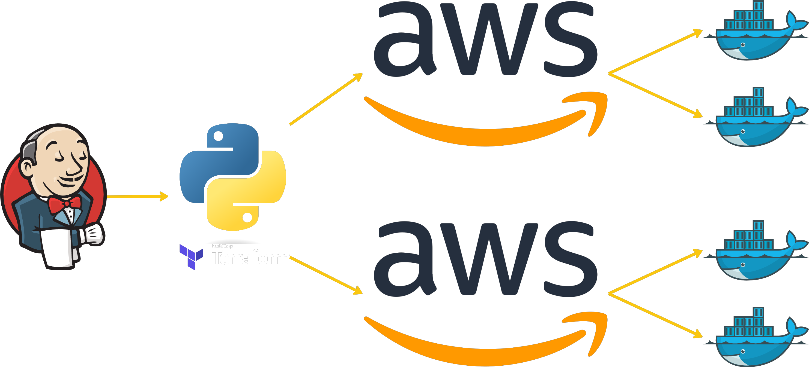

---

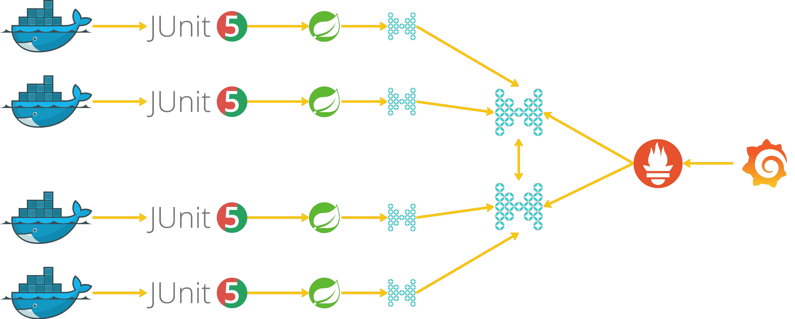

---

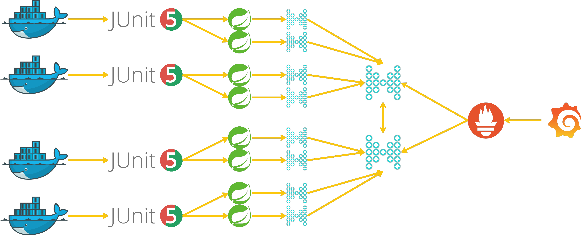

---


<!--
Берем простые вещи и тестируем сложную систему.

Берем ото всех по чуть-чуть и получаем исследование, которое находится на стыке Test и Ops.
-->

---
<!-- _class: main -->

# 🆕 Делать сложную задачу на стыке __Test__ и __Ops__ можно __простыми инструментами__

---

<!-- _class: main2 -->

# 📝 Выявление медленных и частых __SQL__-запросов

## ⚙️ Grafana, ElasticSearch, OpenSearch


---

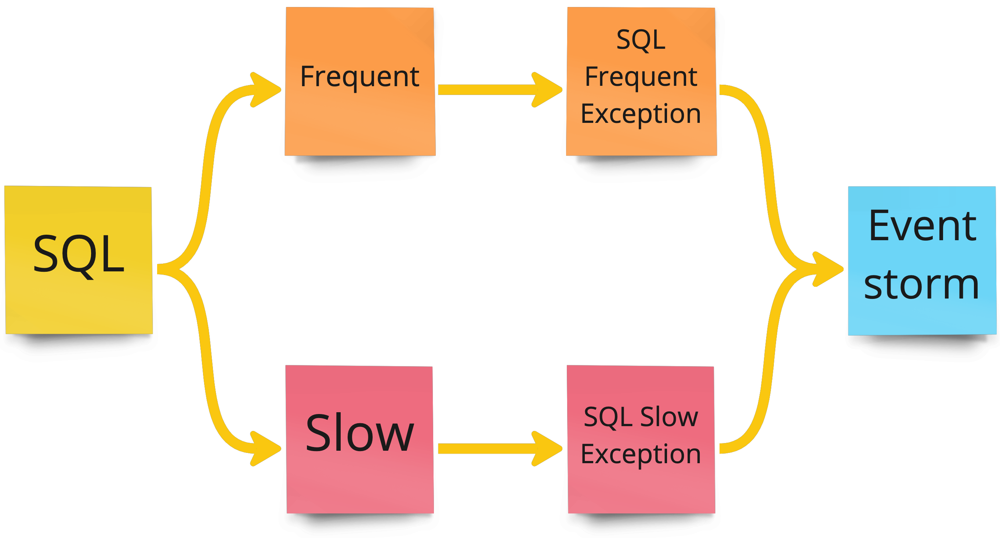

---

# Пример структурированного лога

```yaml
_index: elk-logs-20220607
date: 2022-06-07 15:15:15
level: WARN
server: app-api-000123
function: app-api
thread: http-thread-001234
logger: com.miro.SlowQueryExceptionWrapper
accountid: 0987654321
exceptionLine1: com.miro.ComponentName.ClassName:987
exceptionMessage: SlowQueryException 
with time 10123 ms limit 1000 ms 
with query /*traceId:09876543210987654321*/ 
SELECT id, name, date FROM tableName WHERE date < now()
```


---

# По части полей точно можно фильтровать и группировать

```yaml
_index: elk-logs-20220607
```
```yml
date: 2022-06-07 15:15:15
```
```yaml
level: WARN
```
```yml
server: app-000123
```
```yaml
function: app-api
```
```yml
thread: http-thread-001234
```
```yaml
logger: com.miro.SlowQueryExceptionWrapper
```
```yml
accountid: 0987654321
```
```yaml
exceptionLine1: com.miro.ComponentName.ClassName:987
```
```yml
exceptionMessage: SlowQueryException 
with time 10123 ms limit 1000 ms 
with query /*traceId:09876543210987654321*/ 
SELECT id, name, date FROM tableName WHERE date < now()
```

---

# А часть полей слишком уникальные

```yml
_index: elk-logs-20220607
```
```yaml
date: 2022-06-07 15:15:15
```
```yml
level: WARN
```
```yaml
server: app-000123
```
```yml
function: app-api
```
```yaml
thread: http-thread-001234
```
```yml
logger: com.miro.SlowQueryExceptionWrapper
```
```yaml
accountid: 0987654321
```
```yml
exceptionLine1: com.miro.ComponentName.ClassName:987
```
```yaml
exceptionMessage: SlowQueryException 
with time 10123 ms limit 1000 ms 
with query /*traceId:09876543210987654321*/ 
SELECT id, name, date FROM tableName WHERE date < now()
```

---
# Добавим в __Grafana__ названия полей как переменную-список 
## Сделаем __Repeat__-панели с таблицей и графиком по списку

```yaml
_index,
date,
level,
server,
function,
thread,
logger,
accountid,
exceptionLine1,
exceptionMessage,
...
```

---

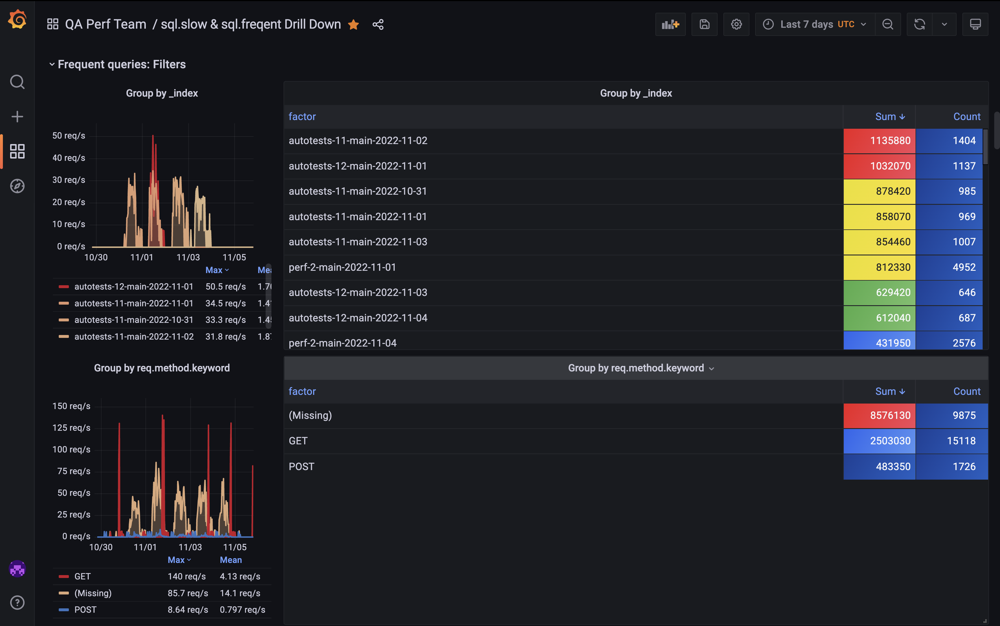

---

<!-- _class: main2 -->

# По каждому значению можно отфильтровать в __один клик__

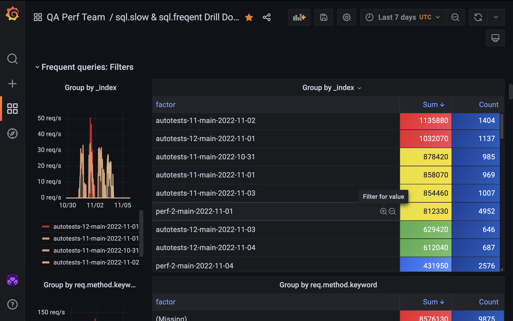


---

<!-- _class: main -->

# 🆕 __Grafana__ и __repeat__-панели позволяют быстро находить __узкие места__ по логам


---

<!-- _class: main2 -->

# 📝 Составить профиль нагрузки 

## ⚙️ Jaeger, Kibana, ElasticSearch, OpenSearch

---

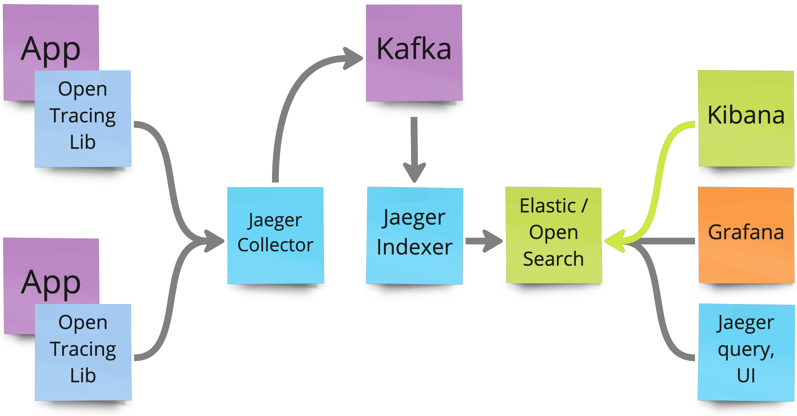

---

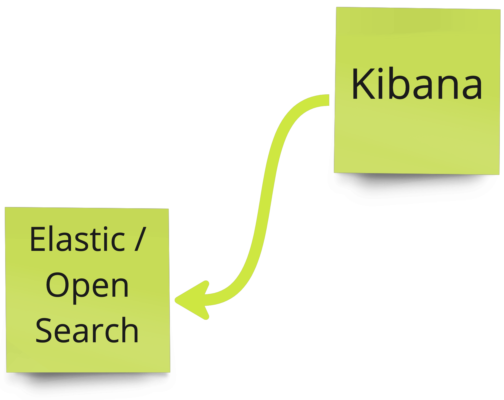


---


---

<!-- _class: main -->

# 🆕 Применение  __Jaeger__ и __OpenTracing__ для анализа профиля нагрузки в __Kibana__


---

<!-- _class: main2 -->

# 📝 Растиражировать тесты по командам и увеличить покрытие профиля нагрузки

## ⚙️ k6


---

# __Переход к простым тестам__, вместо сложных на 100 ручек

```javascript
export function setup() {
    return do_auth(CONF.url, CONF.login, CONF.token);
}
export default function (auth) {
    if (__ITER == 0) do_apply_cookie(auth, CONF.url);
    http.get(`${CONF.url}/api/v1/accounts/${CONF.accountId}`,{
        tags: { name: '(GET) /api/v1/accounts/ID' }});
}
export function teardown(auth) {
    do_apply_cookie(auth, CONF.url); do_logout(CONF.url);
}
export function handleSummary(data) {
    return do_handleSummary(data);
}
```


---

# __auth__ — результат аутентификации, __data__ — статистика

```javascript
export function setup() {
```
```js
    return do_auth(CONF.url, CONF.login, CONF.token);
}
```
```javascript
export default function (auth) {
```
```js
    if (__ITER == 0) do_apply_cookie(auth, CONF.url);
    http.get(`${CONF.url}/api/v1/accounts/${CONF.accountId}`,{
        tags: { name: '(GET) /api/v1/accounts/ID' }});
}
```
```javascript
export function teardown(auth) {
```
```js
    do_apply_cookie(auth, CONF.url); do_logout(CONF.url);
}
```
```javascript
export function handleSummary(data) {
```
```js
    return do_handleSummary(data);
}
```


---

# __Меняется одна функция__ и конфиг при тиражировании

```js
export function setup() {
    return do_auth(CONF.url, CONF.login, CONF.token);
}
```
```javascript
export default function (auth) {
    if (__ITER == 0) do_apply_cookie(auth, CONF.url);
    http.get(`${CONF.url}/api/v1/accounts/${CONF.accountId}`,{
        tags: { name: '(GET) /api/v1/accounts/ID' }});
}
```
```js
export function teardown(auth) {
    do_apply_cookie(auth, CONF.url); do_logout(CONF.url);
}
export function handleSummary(data) {
    return do_handleSummary(data);
}
```

---

<!-- _class: main -->

# 🆕 Переход к __простым__ тестам на узкое место, на проблему

<!--
Написание тестов на узкое место.  Написание маленького теста на проблему.
-->

---

<!-- _class: main2 -->

# 📝 Написать регрессионные нагрузочные тесты-метрики __backend'а__, как замена __Jaeger__

## ⚙️ k6, VictoriaMetrics, Prometheus, InfluxDB, Grafana

---


<!--
_footer: `Slides https://polarnik.github.io/grafana-comparator/`
 -->

---

<!-- _class: main -->

# 🆕 Давать __метрики командам__, важнее, чем отчет и баги по производительности

<!--

Команды пугают другие вещи - мы делали-делали, подали нагрузку, а тут вот ... медленно стало. 

Команды хотят Feature toggle. 

Тестированеи производительности
1) Проверка по факту
2) Метрики на проде, трейсинг, который покажет, в чем узкое место

Arrange, Act, (Assert)

!!!!!

Сделать более яркий переход между слайдами голосом. Интонацией.


-->

---

<!-- _class: main2 -->

# 📝 Запускать тесты с разными профилями на разных стендах, с разных агентов и локально

## ⚙️ docker, docker-compose

---

# __Параметризация__ тестовых данных, стенда и профиля
```yaml
  k6_test_accounts:
    image: grafana/k6:0.40.0
    restart: "no"
    volumes:
      - "./src/test/config/:/tmp/src/test/config/:ro"
      - "./src/test/k6/:/tmp/src/test/k6/:ro"
      - "./results/k6_test_account:/tmp/results/:rw"
    environment:
      - TEST_CONFIG=perf-environment-1.big-workload.json  # Стенд и тестовые данные   
      - K6_RPS=20                                         # Интенсивность (профиль)
      - K6_VUS=20                                         # Время отклика (SLA)
      - K6_ITERATIONS=10000                               # Длительность теста
    working_dir: "/tmp/results/"
    command: "run --insecure-skip-tls-verify
    --out influxdb=http://influxdb:8086/k6 
    /tmp/src/test/k6/test_accounts.js
    "
```

<!--
Почему раньше не запускали тесты из Docker? Были проблемы производительности самого Docker. Сейчас он позволяет.

Istio, Envoy, balancer, ...

Особенно, когда тестируются сервисы развернутые в k8s

Разработчик может запустить нагрузку локального с локальной машины разработчика

-->

---

# Для __Taurus__ надо будет получить __ENV__ с профилем скриптом

```yaml
  k6_test_accounts_taurus:
    image: blazemeter/taurus:1.16.17
    restart: "no"
    volumes:
      - "./src/test/config/:/tmp/src/test/config/:ro"
      - "./src/test/k6/:/tmp/src/test/k6/:ro"
      - "./results/k6_test_accounts:/tmp/results/:rw"
      - "./src/test/bzt-configs/:/bzt-configs"
      - "./results/k6_test_accounts_taurus:/tmp/artifacts:rw"
      - "./src/test/k6/lib/taurusOpts.js:/tmp/src/test/k6/lib/commonOptions.js:ro"    
    environment:
      - TEST_CONFIG=perf-environment-1.big-workload.json  # Стенд и тестовые данные   
      - K6_RPS=20                                         # Интенсивность (профиль)
      - K6_VUS=20                                         # Время отклика (SLA)
      - K6_ITERATIONS=10000                               # Длительность теста
    working_dir: "/tmp/results/"
    command: "/bzt-configs/test_accounts.yaml"
```

---

# В __Docker__ можно монтировать и каталог и файл в каталоге

```yml
  k6_test_accounts_taurus:
    image: blazemeter/taurus:1.16.17
    restart: "no"
    volumes:
      - "./src/test/config/:/tmp/src/test/config/:ro"                                 
```
```yaml
      - "./src/test/k6/:/tmp/src/test/k6/:ro"                                         
```
```yml
      - "./results/k6_test_accounts:/tmp/results/:rw"
      - "./src/test/bzt-configs/:/bzt-configs"
      - "./results/k6_test_accounts_taurus:/tmp/artifacts:rw"                         
```
```yaml
      - "./src/test/k6/lib/taurusOpts.js:/tmp/src/test/k6/lib/commonOptions.js:ro"    
```
```yml
    environment:
      - TEST_CONFIG=perf-environment-1.big-workload.json  # Стенд и тестовые данные   
      - K6_RPS=20                                         # Интенсивность (профиль)
      - K6_VUS=20                                         # Время отклика (SLA)
      - K6_ITERATIONS=10000                               # Длительность теста
    working_dir: "/tmp/results/"
    command: "/bzt-configs/test_accounts.yaml"
```

---

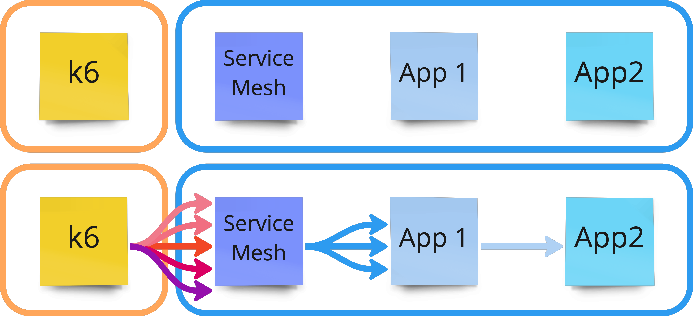

---


---

<!-- _class: main -->

# 🆕 Запуск тестов из __Docker__ удобен и перспективен

---

<!-- _class: main2 -->

# 📝 Автоматизация нагрузки по расписанию или кнопке

## ⚙️ Jenkins, Pipeline, Python, Ansible, Terraform

<!--
Много денег надо будет за облако. И для нагрузки становится важно развертывать и свертывать конрут нагрузки.
-->

---

# Работа со стендом и метриками наиболее сложны

- Восстановление системы из снимка
- Обновление версии системы
- Запуск и подготовка системы к тестированию
- Запуск тестов производительности
    - Запомнить время старта
    - Запустить профилирование до старта
    - __Тест__, скрипт подачи нагрузки
    - Сохранить результаты теста
    - Сохранить системные метрики за тест
    - Сохранить логи, результаты профилирования и ссылки
    - Сравнить метрики и отправить нотификации о деградации
- Остановка системы
- Остановка окружения

---

<!-- _class: main -->

# 🆕 Облачный тестовый стенд __автоматически создается__ для тестирования

---

<!-- _class: main2 -->

# 📝 Написать регрессионные нагрузочные тесты-метрики __frontend'а__, как замена __Jaeger__

## ⚙️ __sitespeed.__**io**


---
<!-- _class: main2 -->

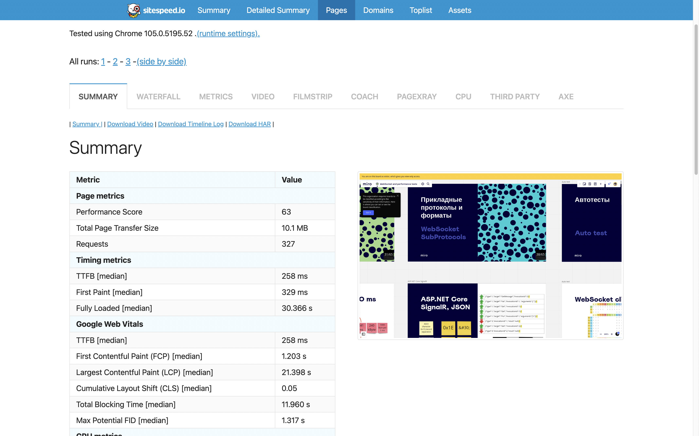

# __Потрясающие отчеты__

---

<!-- _class: main2 -->

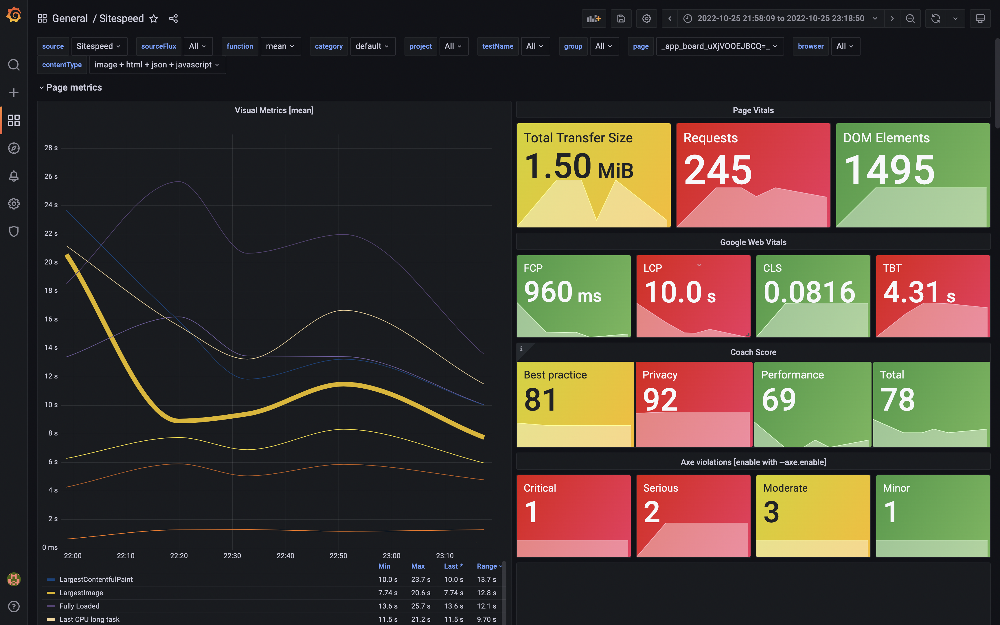

# Просто потрясающие отчеты

---
<!-- _class: main2 -->

# __А если нужна аутентификация?__

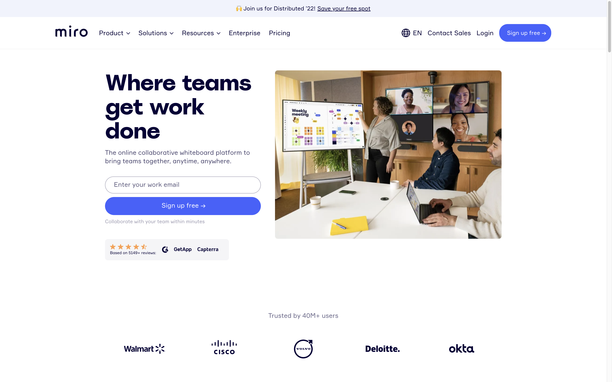

---

# В конфиге теста настроим использование __user-data-dir__

```json
    "chrome": {
      "enableTraceScreenshots": false,
      "includeResponseBodies": false,
      "ignoreCertificateErrors": true,
      "collectConsoleLog": true,
      "collectLongTasks": true,
      "collectNetLog": true,
      "args": [
        "user-data-dir=/tmp/user-data-dir/",
        "no-pings",
        "no-report-upload",
        "no-first-run",
        "no-default-browser-check"
      ]
    }
```

---
# Сначала сделаем __аутентификацию__ в папку __user-data-dir__

```yaml
  sitespeed_login:
    image: sitespeedio/sitespeed.io:25.11.0-plus1
    volumes:
      - "./src/test/config/:/sitespeed.io/test/config/:ro"
      - "./src/test/javascript/:/tmp/src/test/javascript/:ro"
      - "./report:/sitespeed.io/sitespeed-result/:rw"
      - "./user-data-dir:/tmp/user-data-dir/:rw"
    restart: "no"
    command: "--config /sitespeed.io/test/config/login.json 
    /tmp/src/test/javascript/app-auth-login-basic.js
    -n 1"
```
---

# А потом __тесты__ с той же папкой __user-data-dir__

```yaml
  sitespeed_test_miro_wo_cache:
    image: sitespeedio/sitespeed.io:25.11.0-plus1
    volumes:
      - "./src/test/config/:/sitespeed.io/test/config/:ro"
      - "./src/test/javascript/:/tmp/src/test/javascript/:ro"
      - "./report:/sitespeed.io/sitespeed-result/:rw"
      - "./user-data-dir:/tmp/user-data-dir/:rw"
    restart: "no"
    command: "--config /sitespeed.io/test/config/test.json 
    /tmp/src/test/javascript/clear.js
    https://domain.com/someUrl-for-testing
    -n 3"
```


---

<!-- _class: main -->

# 🆕 Тесты фронта с __sitespeed__**.io** делаются просто, приносят массу пользы

<!--
lithhouse -- для ручной проверки.
А тут как LH с мониторингом
-->

---

<!-- _class: main -->

# 2️⃣ Что нового в нагрузке сделали другие?

<!--
_footer: `Image by Vlad Gerasimov on https://vlad.studio/`
 -->

---

<div align="center"><video autoplay loop html muted class="bg" onclick="this.paused ? this.play() : this.pause(); this.blur()" onpause="" width="80%"><source src="img/plan2.mp4" type="video/mp4"></video></div>

---

- Андрей Похилько - новый инструмент для нагрузки и Mizu.io - отличная утилита для разбора проблем в Kubernetes
- Илья Бровкин - новая платформа для Web3 https://www.linkedin.com/in/iliyabrovkin/
- Олесь Писаренко - новый инструмент для нагрузки на GoLang https://www.linkedin.com/in/doctornkz/
- Андрей Сатарин - https://www.linkedin.com/in/asatarin/ тестирование корректности распределенных систем во время обновления и отката версиий в дополнение к стресс-тестированию в помощью unit-тестов, выполняемых во время обновления или масштабирования системы https://asatarin.github.io/talks/2022-09-upgrade-failures-in-distributed-systems/
- Андрей Акиньшин - новая книга Профессиональный бенчмаркинг
- Антон Серпутько - работает в США, участвовал в подкасте по производительности https://t.me/dou_qa/484
- Mark Tomlinson - сделал курс по эксплуатационному тестированию производительности, тестирование цель которого в поиске узких мест и записал много новых выпусков подкаста PerfBytes https://www.linkedin.com/in/mtomlins/ 
- Paul McLean - предоставляет API для тестовых данных, https://www.youtube.com/watch?v=bFAICy5j35M https://www.linkedin.com/in/paulmclean2/ интересные материалы, тестирование производительности Starlink и геораспределенное тестирование с помощью Gatling, тренды тестирования приоизводительности в 2021 году https://www.youtube.com/watch?v=z3yvh4syuqw и https://www.mammoth-ai.com/top-performance-engineering-trends-5-things-your-team-needs-to-know/
- Joe Calantonio, Performance & SRE Podcast https://testguild.com/podcasts/performance/ и https://www.linkedin.com/in/joecolantonio/
- Andreas Grabner https://www.linkedin.com/in/grabnerandi/ OpenTelemetry, Keptn
- Federico Toledo, jmeter-java-dsl https://www.linkedin.com/in/federicotoledo/
- Vitaly Friedman, https://www.linkedin.com/in/vitalyfriedman/, 
- Alex Xu, https://www.linkedin.com/in/alexxubyte/ System Design
- 🤠Leandro Melendez (Señor Performo) https://www.linkedin.com/in/leandromelendez/ интервью с разными инженерами
- Henrik Rexed https://www.linkedin.com/in/hrexed/ Observability, Dynatrace, OpenTelemetry, eBPF
- Jason Arbon, test.ai, https://www.linkedin.com/in/jasonarbon/ 
Batch вставка результатов тестов, после выполнения всех тестов это быстрее, чем вставка результатов тестов после каждого теста
- Mehdi Daoudi, Cachpoint https://www.linkedin.com/in/mdaoudi/ 
- Kent Beck, 
- Stephen Townshend, https://www.linkedin.com/in/stephentownshend/
- Jeff Barr, 
- Delvis Echeverria, https://www.linkedin.com/in/delvisecheverria/recent-activity/
- Denis Bakhvalov, https://www.linkedin.com/in/dendibakh/
- 


---


<!--
_footer: `Generated by https://huggingface.co/spaces/PaddlePaddle/ERNIE-ViLG`
 -->

---


<!--
_footer: `Generated by https://huggingface.co/spaces/PaddlePaddle/ERNIE-ViLG`
 -->

---


<!--
_footer: `Generated by https://huggingface.co/spaces/PaddlePaddle/ERNIE-ViLG`
 -->

 ---

<!-- _class: main -->

# Будущее будет быстрым

 

 <!--
_footer: Image from <a gref="https://pikabu.ru/story/i_want_to_believe_6676390">pikabu.ru</a>
 -->